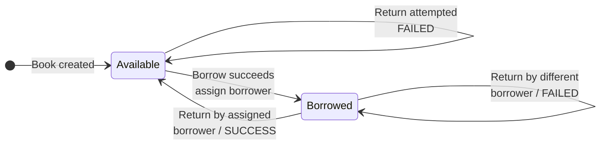
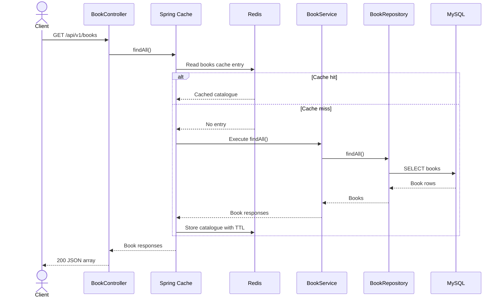
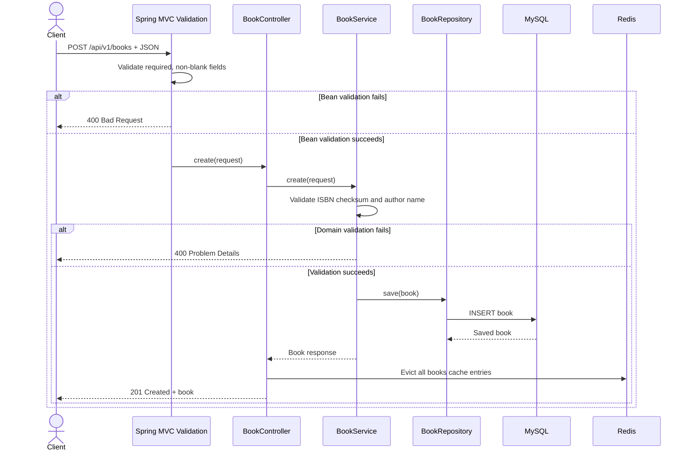
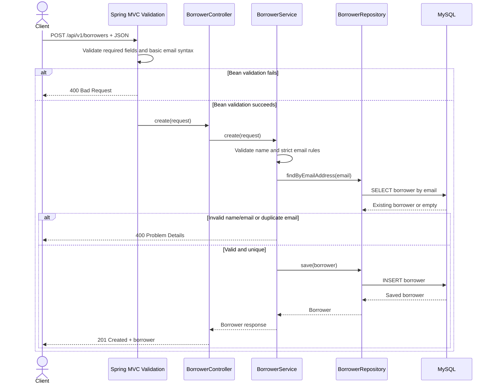
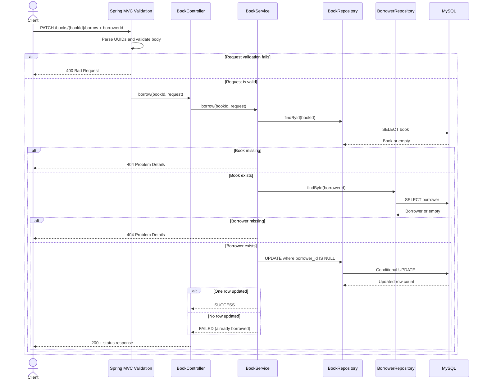
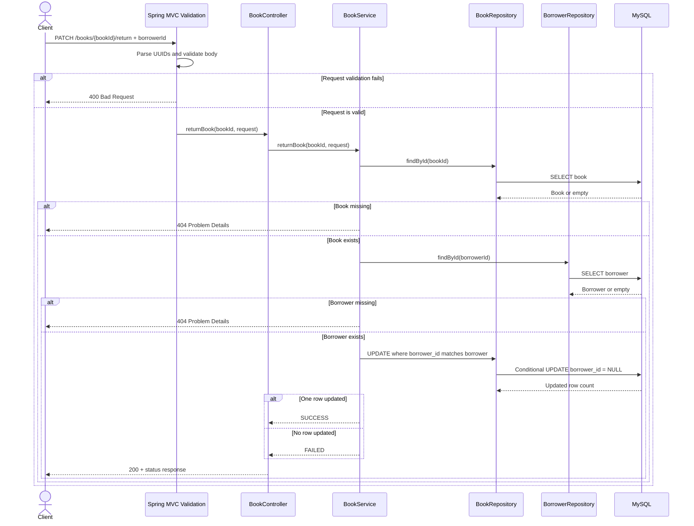

# Library System API

The Library System API registers borrowers, maintains a catalogue of books, and
coordinates borrowing and returning a single physical book record. It is a JSON
REST API implemented with Spring Boot, MySQL, and a Redis-backed catalogue
cache.

For a machine-readable contract, see [openapi.yaml](openapi.yaml).

## Assumptions and design decisions

The project requirements define the core resources and operations but leave the
following details unspecified. The current implementation makes these
assumptions and design decisions:

- **Identity and access:** The server generates UUIDs for books and borrowers.
  The API uses versioned JSON REST endpoints and does not require authentication
  or authorization.
- **Borrowers:** A borrower must be registered before their UUID can be used to
  borrow or return a book. Email addresses are syntax-validated and treated as
  unique. Borrower names accept Unicode letters and combining marks, with single
  spaces between words; digits, punctuation, leading/trailing spaces, and
  repeated spaces are rejected.
- **Books and ISBNs:** Each book record represents one physical copy and has its
  own UUID. ISBN-10 and ISBN-13 checksums are validated. Spaces and hyphens are
  accepted in an ISBN, and its submitted formatting is preserved. Book titles
  must be non-blank, while author names follow the same character rules as
  borrower names.
- **ISBN consistency responsibility:** Multiple copies may share an ISBN, but
  the API does not verify that existing records with that ISBN have the same
  title and author. API clients are expected to preserve this required
  relationship.
- **Circulation:** A book copy can be assigned to at most one borrower at a
  time, and only its assigned borrower can return it. Conditional database
  updates resolve concurrent borrow attempts. The system does not maintain loan
  history, due dates, borrowing limits, renewals, or reservations.
- **Responses and listing:** Invalid inputs return `400 Bad Request`, and missing
  books or borrowers return `404 Not Found`. Borrow and return conflicts return
  HTTP `200 OK` with `status: "FAILED"`. The complete book list is unpaginated,
  has no guaranteed ordering, and does not expose current availability.
- **Infrastructure:** MySQL is the persistent data store. Redis caches only the
  book catalogue, with a default lifetime of 30 minutes. If Redis is unavailable,
  catalogue operations continue against MySQL without caching.
- **Delivery:** A successful build triggered by a push to `main` publishes the
  application image to Docker Hub. Image publication is automated, but deployment
  to a running environment is not.

## Conventions

| Item | Value |
| --- | --- |
| Base URL | `http://localhost:8080` |
| API prefix | `/api/v1` |
| Request format | `application/json` for requests with a body |
| Success format | `application/json` |
| Application error format | `application/problem+json` |
| Identifiers | UUID strings, such as `8cbdd372-417c-4e77-b6bf-87d650681abb` |
| Authentication | None |

The server port can be changed through configuration. Substitute the configured
port for `8080` in the examples below.

### Validation rules

- All documented request fields are required and cannot be blank or `null`.
- Borrower emails must be syntactically valid, no longer than 254 characters,
  and unique among registered borrowers.
- Borrower names and book authors may contain Unicode letters, combining marks,
  and single spaces between words. Digits, punctuation, leading/trailing spaces,
  and repeated spaces are rejected.
- An ISBN may contain hyphens or spaces, which are removed before validation. It
  must then be a checksum-valid ISBN-10 or ISBN-13. ISBN-10 accepts `X` or `x` as
  its final checksum character.
- Book IDs and borrower IDs must be valid UUIDs.

### Error responses

Domain errors use a Problem Details response. For example:

```json
{
  "type": "about:blank",
  "title": "Book not found",
  "status": 404,
  "detail": "Book not found",
  "instance": "/api/v1/books/8cbdd372-417c-4e77-b6bf-87d650681abb/borrow"
}
```

The exact extra fields in framework-generated `400 Bad Request` responses may
vary. Clients should rely on the HTTP status and, when present, the standard
Problem Details fields rather than parsing error text.

### Catalogue caching

Only `GET /api/v1/books` is cached. A cache miss reads all books from MySQL and
stores the response in Redis. Creating a book clears the complete `books` cache.
Borrowing and returning do not clear it because catalogue responses do not
include borrowing information. The configured default cache lifetime is 30
minutes.

## Choice of Database

MySQL was selected because it is straightforward to configure and is a good fit
for this project's relational data model. Borrowers, books, and their current
loan relationship map naturally to tables and a foreign key, while the required
operations are primarily straightforward create, read, and update operations.

MySQL also provides the ACID transaction guarantees needed to keep borrow and
return operations consistent. The application combines those transactions with
an atomic conditional update that assigns a borrower only when a book's
`borrower_id` is `NULL`. When concurrent requests try to borrow the same copy,
only one update can succeed.

Indexes reduce lookup time for the identifiers used by the API. The current
schema uses primary-key indexes for book and borrower UUIDs and a unique index
for borrower email addresses, supporting identifier lookups and duplicate-email
checks efficiently.

## CI/CD workflow

The [GitHub Actions workflow](../.github/workflows/build-deploy.yml) performs
continuous integration and publishes a Docker image when changes are pushed to
the `main` branch. Pull requests and pushes to other branches do not trigger the
workflow.

The working pipeline and its published artifacts can be viewed here:

- [GitHub Actions workflow runs](https://github.com/mdaimanz/library-system/actions)
- [Published Docker Hub image tags](https://hub.docker.com/r/aimanmasod/my-personal-project/tags)

The `build-deploy` job runs on GitHub's latest Ubuntu runner and performs these
steps:

1. Checks out the repository.
2. Configures Temurin JDK 17 and enables Maven dependency caching.
3. Runs `mvn clean verify -B` to compile the application and execute its tests.
4. Authenticates with Docker Hub.
5. Configures Docker Buildx and derives the image metadata.
6. Builds the repository `Dockerfile` for `linux/amd64` and pushes
   `aimanmasod/my-personal-project` with both of these tags:
   - `latest`
   - `sha-<short-commit-SHA>`

Docker Hub authentication requires the following GitHub repository settings:

| Setting type | Name | Purpose |
| --- | --- | --- |
| Repository variable | `DOCKERHUB_USERNAME` | Docker Hub account used by the login action. |
| Repository secret | `DOCKERHUB_TOKEN` | Docker Hub access token used to authenticate. |

Despite the workflow and job name `build-deploy`, the workflow stops after
publishing the image. It does not deploy the image to a server, container
platform, or other running environment.

## Book availability state machine

The `borrower_id` column represents availability: `NULL` means the book is
available, and a borrower UUID means it is borrowed. Conditional database
updates prevent two borrowers from successfully borrowing the same book and
prevent a borrower from returning a book assigned to somebody else.




Missing book or borrower records produce `404 Not Found` before a state change
is attempted.

## List all books

`GET /api/v1/books`

Returns the complete book catalogue. Use this endpoint to display or refresh a
client-side list of registered books. An empty catalogue returns an empty JSON
array.

### Request

No path parameters, query parameters, or request body are accepted.

```shell
curl http://localhost:8080/api/v1/books
```

### Response

`200 OK`

```json
[
  {
    "id": "8cbdd372-417c-4e77-b6bf-87d650681abb",
    "isbnNumber": "978-1-56619-909-4",
    "title": "Clean Code",
    "author": "Robert Martin"
  }
]
```

| Field | Type | Description |
| --- | --- | --- |
| `id` | UUID | Server-generated book identifier. |
| `isbnNumber` | string | ISBN exactly as supplied when the book was created. |
| `title` | string | Book title. |
| `author` | string | Author name. |

### Sequence



## Create a book

`POST /api/v1/books`

Adds a physical book record to the catalogue. The API does not enforce ISBN
uniqueness, so multiple book records may share an ISBN.

### Request

```shell
curl -X POST http://localhost:8080/api/v1/books \
  -H "Content-Type: application/json" \
  -d '{"isbnNumber":"978-1-56619-909-4","title":"Clean Code","author":"Robert Martin"}'
```

```json
{
  "isbnNumber": "978-1-56619-909-4",
  "title": "Clean Code",
  "author": "Robert Martin"
}
```

| Field | Type | Rules |
| --- | --- | --- |
| `isbnNumber` | string | Required, non-blank, checksum-valid ISBN-10 or ISBN-13 after removing spaces and hyphens. |
| `title` | string | Required and non-blank. |
| `author` | string | Required, non-blank, and must follow the name rules above. |

### Responses

- `201 Created`: returns the created book using the same fields as a catalogue
  item, including its generated `id`.
- `400 Bad Request`: a field is missing or blank, the ISBN is invalid, or the
  author does not follow the accepted name format.

Example success response:

```json
{
  "id": "8cbdd372-417c-4e77-b6bf-87d650681abb",
  "isbnNumber": "978-1-56619-909-4",
  "title": "Clean Code",
  "author": "Robert Martin"
}
```

### Sequence



Cache eviction is performed by the Spring cache interceptor after a successful
service invocation; it is shown next to the controller boundary for readability.

## Register a borrower

`POST /api/v1/borrowers`

Registers a person who can borrow books. A borrower must be created before their
UUID can be used by the borrow or return endpoints.

### Request

```shell
curl -X POST http://localhost:8080/api/v1/borrowers \
  -H "Content-Type: application/json" \
  -d '{"name":"Ada Lovelace","email":"ada@example.com"}'
```

```json
{
  "name": "Ada Lovelace",
  "email": "ada@example.com"
}
```

| Field | Type | Rules |
| --- | --- | --- |
| `name` | string | Required, non-blank, and must follow the name rules above. |
| `email` | string | Required, non-blank, valid email syntax, at most 254 characters, and unique. |

### Responses

- `201 Created`: returns the registered borrower.
- `400 Bad Request`: validation fails or the email is already registered.

Example success response (note that the response field is `emailAddress`):

```json
{
  "id": "ff17e35c-d105-4d08-a573-d8f992d544c1",
  "name": "Ada Lovelace",
  "emailAddress": "ada@example.com"
}
```

### Sequence



## Borrow a book

`PATCH /api/v1/books/{bookId}/borrow`

Assigns an available book to a registered borrower. The assignment uses a
conditional database update, so only one concurrent request can change an
available book to borrowed.

### Request

| Location | Name | Type | Rules |
| --- | --- | --- | --- |
| Path | `bookId` | UUID | Required; must identify an existing book. |
| Body | `borrowerId` | UUID | Required; must identify an existing borrower. |

```shell
curl -X PATCH http://localhost:8080/api/v1/books/8cbdd372-417c-4e77-b6bf-87d650681abb/borrow \
  -H "Content-Type: application/json" \
  -d '{"borrowerId":"ff17e35c-d105-4d08-a573-d8f992d544c1"}'
```

### Responses

- `200 OK` with `status: "SUCCESS"`: the book was available and is now assigned
  to the borrower.
- `200 OK` with `status: "FAILED"`: the book was already assigned to a borrower.
  This is a business conflict, not an HTTP error in the current API.
- `400 Bad Request`: the path UUID or body is malformed, or `borrowerId` is
  missing.
- `404 Not Found`: the book or borrower does not exist.

Success:

```json
{
  "status": "SUCCESS",
  "description": "Book 8cbdd372-417c-4e77-b6bf-87d650681abb is now borrowed by ff17e35c-d105-4d08-a573-d8f992d544c1"
}
```

Business failure:

```json
{
  "status": "FAILED",
  "description": "Book 8cbdd372-417c-4e77-b6bf-87d650681abb is currently borrowed by someone else"
}
```

### Sequence



## Return a book

`PATCH /api/v1/books/{bookId}/return`

Returns a book only when it is currently assigned to the borrower in the request.
Supplying a different borrower does not change the assignment.

### Request

| Location | Name | Type | Rules |
| --- | --- | --- | --- |
| Path | `bookId` | UUID | Required; must identify an existing book. |
| Body | `borrowerId` | UUID | Required; must identify an existing borrower and match the current assignment. |

```shell
curl -X PATCH http://localhost:8080/api/v1/books/8cbdd372-417c-4e77-b6bf-87d650681abb/return \
  -H "Content-Type: application/json" \
  -d '{"borrowerId":"ff17e35c-d105-4d08-a573-d8f992d544c1"}'
```

### Responses

- `200 OK` with `status: "SUCCESS"`: the matching borrower returned the book.
- `200 OK` with `status: "FAILED"`: the book was available already or assigned
  to a different borrower. This is a business conflict, not an HTTP error in the
  current API.
- `400 Bad Request`: the path UUID or body is malformed, or `borrowerId` is
  missing.
- `404 Not Found`: the book or borrower does not exist.

Success:

```json
{
  "status": "SUCCESS",
  "description": "Book 8cbdd372-417c-4e77-b6bf-87d650681abb is successfully returned"
}
```

Business failure:

```json
{
  "status": "FAILED",
  "description": "Return process failed"
}
```

### Sequence


